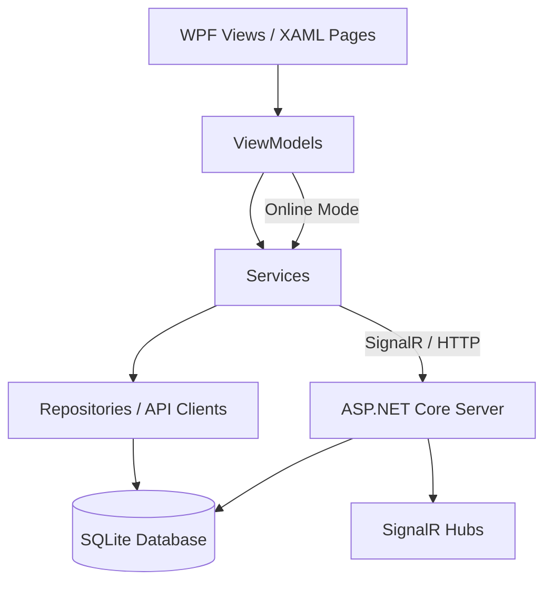
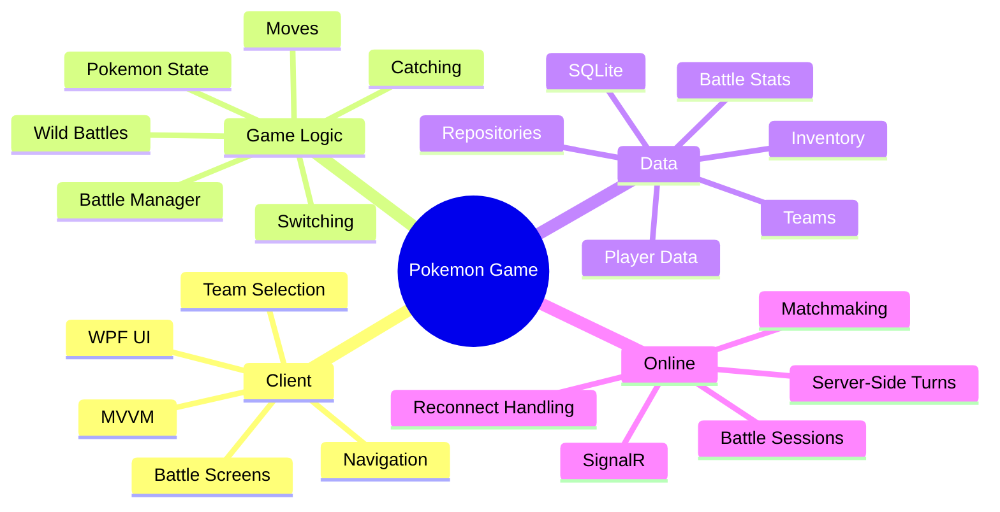
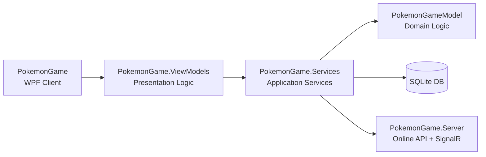
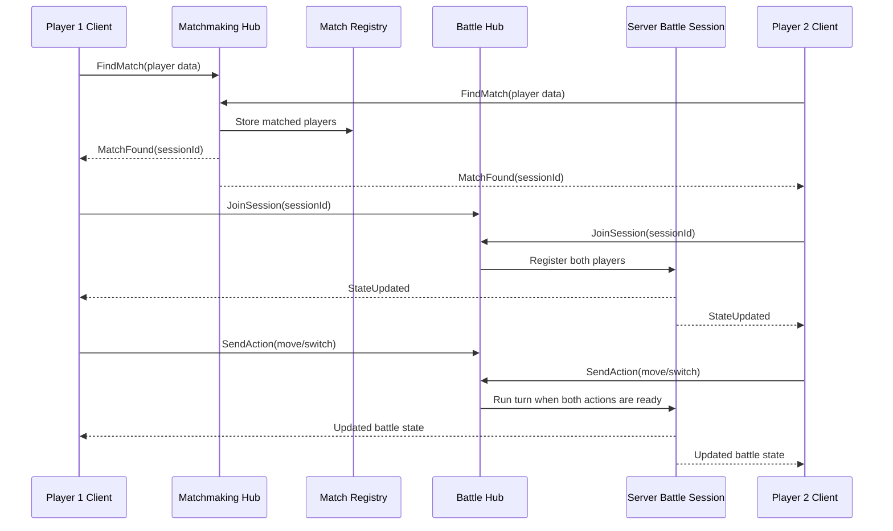
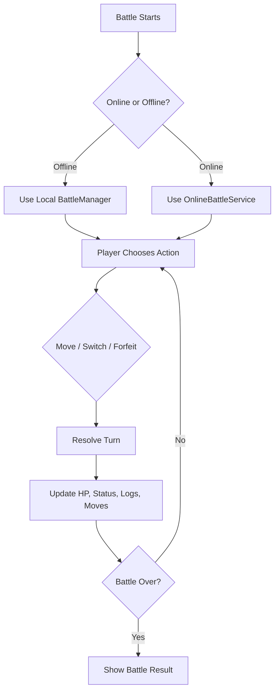
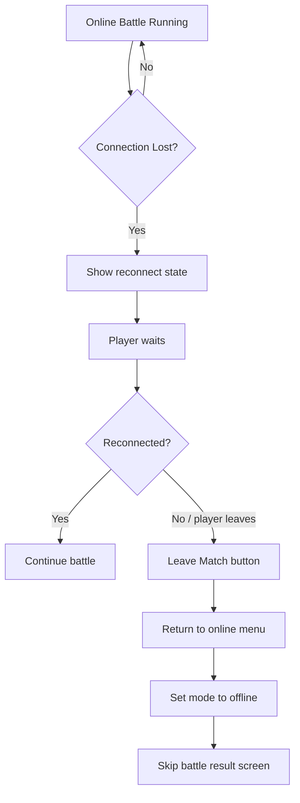
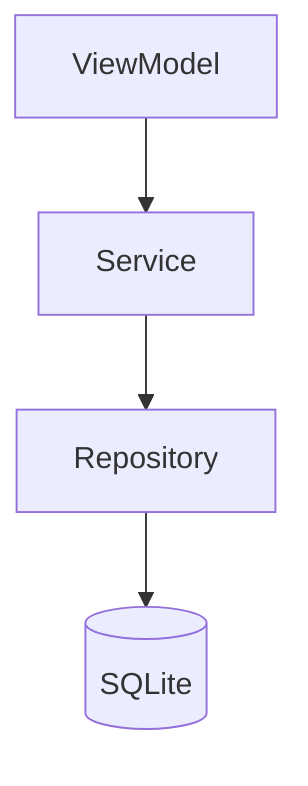
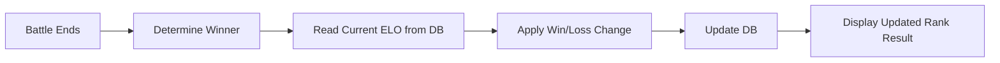
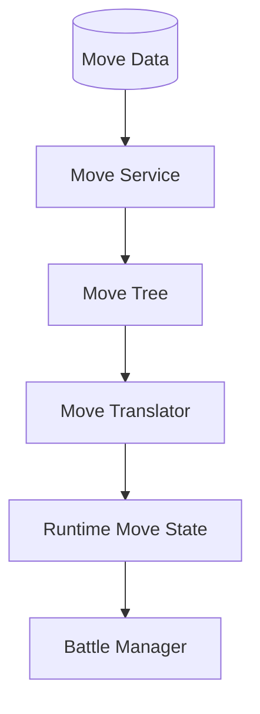

# Pokémon Game

> A learning-focused Pokémon-inspired desktop RPG built with C#, WPF, SQLite, ASP.NET Core, and SignalR.

This project is a full-stack learning project that explores how a larger game-style application can be structured using real software architecture patterns: layered projects, MVVM, service/repository separation, local persistence, and real-time client-server communication.

The goal of the project is not to create a commercial Pokémon clone, but to practice building a complete, connected application with many moving parts: UI, game logic, database access, online matchmaking, battle sessions, and player data.

---

## Table of Contents

* [About the Project](#about-the-project)
* [Why This Project Exists](#why-this-project-exists)
* [Tech Stack](#tech-stack)
* [Architecture](#architecture)
* [Main Systems](#main-systems)
* [Online Battle Flow](#online-battle-flow)
* [Battle System](#battle-system)
* [Database-Driven Design](#database-driven-design)
* [Project Structure](#project-structure)
* [Learning Goals](#learning-goals)
* [Current Status](#current-status)
* [Future Improvements](#future-improvements)

---

## About the Project

**Pokémon Game** is a desktop RPG project inspired by classic Pokémon-style gameplay.

The application includes:

* A WPF desktop client
* Local gameplay systems
* Wild Pokémon battles
* Team selection and team management
* Online matchmaking
* Online PvP battle sessions
* SQLite-based persistence
* Server communication using SignalR
* Layered architecture with Models, Services, ViewModels, and Server projects

This project was built mainly for learning and gaining experience in architecture design, design patterns and working on a big project, as such the game ui design was rushed and features that will not help learn or gain experience were not implemented. 
For example: different bot difficulty.

It demonstrates how a game can be structured beyond a simple UI demo, with real separation between game logic, UI state, services, repositories, database access, and server-side online flow.

---

## Why This Project Exists

This project was created to practice building a larger C# application with multiple connected systems.

Instead of building a small isolated exercise, this project focuses on problems that appear in real software:

* How should UI logic be separated from domain logic?
* How should game data be stored and loaded?
* How should online and offline modes share battle screens?
* How can a client recover from server disconnects?
* How should a turn-based multiplayer battle be synchronized?
* How can database-backed player stats be connected to the result screen?

The project is intentionally ambitious because the point is to learn by building something complex enough to break in interesting ways. Naturally, it did. That is where the learning happened.

---

## Tech Stack

| Area                    | Technology                 |
| ----------------------- | -------------------------- |
| Desktop Client          | WPF                        |
| Client Language         | C#                         |
| Client Framework        | .NET Framework 4.8         |
| Server                  | ASP.NET Core               |
| Server Framework        | .NET 8                     |
| Real-Time Communication | SignalR                    |
| Database                | SQLite                     |
| Data Access             | Dapper / repository layer  |
| UI Pattern              | MVVM                       |
| MVVM Toolkit            | CommunityToolkit.Mvvm      |
| Architecture            | Layered application design |

---

## Architecture

The solution is separated into multiple projects so each layer has a clear responsibility.



### Main idea

The UI should not directly control the database or battle rules.

Instead:

```text
View → ViewModel → Service → Repository → Database
```

For online battles:

```text
Client ViewModel → Online Service → SignalR Hub → Server Battle Session
```

This keeps the project easier to reason about and makes each layer responsible for its own job.

---

## Main Systems



---

## Project Structure

```text
PokemonGame/
│
├── PokemonGame
│   └── WPF desktop client
│
├── PokemonGame.ViewModels
│   └── ViewModels, navigation state, UI logic
│
├── PokemonGameModel
│   └── Domain models and core game logic
│
├── PokemonGame.Services
│   └── Services, repositories, API clients, data models
│
└── PokemonGame.Server
    └── ASP.NET Core server, controllers, SignalR hubs
```

---

## Project Layers



### `PokemonGame`

The WPF desktop client.

Contains:

* Pages
* Windows
* User controls
* XAML UI
* Application startup

This is the visual layer of the application.

### `PokemonGame.ViewModels`

The presentation logic layer.

Contains:

* Battle ViewModels
* Online battle menus
* Profile-related ViewModels
* Navigation state
* Commands
* UI-specific state

This layer connects the UI to the actual application logic.

### `PokemonGameModel`

The domain/game logic layer.

Contains:

* Pokémon state
* Battle managers
* Move models
* Enums
* Battle-related domain objects

This layer should describe the rules of the game, not how the UI looks.

### `PokemonGame.Services`

The application service and data access layer.

Contains:

* Repository classes
* SQLite data access
* API clients
* Online battle services
* Matchmaking service
* DTOs / data models
* Sync-related logic

This layer connects the application to the database and server.

### `PokemonGame.Server`

The online server.

Contains:

* ASP.NET Core server setup
* SignalR hubs
* Matchmaking hub
* Battle hub
* Profile controller
* Server-side battle session handling

---

## Online Battle Flow

The online system uses SignalR to connect two players into a battle session.



The server is responsible for coordinating the online battle session and pushing updated battle snapshots back to the clients.

---

## Battle System

The battle system supports both offline and online battles.



### Offline battles

Offline battles use local battle logic directly.

Examples:

* Wild battles
* Bot battles
* Local turn resolution

### Online battles

Online battles send player actions to the server.

The server waits until both players have submitted an action, resolves the turn, and sends updated snapshots back to each client.

---

## Wild Battles

Wild battles are local gameplay only.

They support:

* Selecting moves
* Switching Pokémon
* Opening the bag
* Throwing Poké Balls
* Catching Pokémon
* Fleeing
* Returning to the map

Wild battles are not connected to the server.

This separation is important because server reconnect and online session recovery should not affect local wild battles.

---

## Online Disconnect Handling

The online battle system includes logic for handling broken online sessions.



If the server loses the battle session or the player disconnects from the match, the client should return safely to the online battle menu without showing a win/loss result.

This avoids treating server failures as player losses.

---

## Database-Driven Design

The project uses SQLite to store structured game and player data.

Database-backed systems include:

* Player profile data
* Battle player statistics
* 1v1 and 2v2 ELO fields
* Teams
* Pokémon data
* Inventory
* Items
* Move data
* Settings

The database is accessed through repositories instead of directly from the UI.



---

## Ranking / ELO System

The project includes database support for battle player statistics.

The stats system includes separate fields for:

* Current ELO 1v1
* Peak ELO 1v1
* Wins 1v1
* Current streak 1v1
* Best streak 1v1
* Current ELO 2v2
* Peak ELO 2v2
* Wins 2v2
* Current streak 2v2
* Best streak 2v2

The intended flow is:



Offline battles should not update online ELO.

---

## Move System

The move system is designed around structured move data instead of simple hardcoded attacks.

A move can be translated into runtime behavior with:

* Accuracy checks
* Damage effects
* Status effects
* Conditions
* Sequences
* Multi-step logic
* Battle messages

Conceptually:



This makes the move system more flexible than placing every move directly inside battle code.

---

## Learning Goals

This project was built to practice:

* Building a desktop application with WPF
* Applying the MVVM pattern
* Separating UI, services, data access, and domain logic
* Designing a turn-based battle system
* Managing local and online gameplay modes
* Using SQLite as an application database
* Using repositories for data access
* Building an ASP.NET Core server
* Using SignalR for real-time multiplayer communication
* Handling online matchmaking
* Managing server disconnects and invalid sessions
* Working with a larger multi-project C# solution

---

## What I Learned

This project helped me practice:

* Structuring a larger C# solution
* Debugging interactions between UI and game logic
* Designing service and repository layers
* Managing ViewModel state in WPF
* Handling asynchronous online communication
* Thinking about failure cases such as server crashes and reconnects
* Keeping offline and online gameplay flows separate
* Working with database-backed player progression

---

## Current Status

This is an active learning project.

Implemented areas include:

* WPF desktop client
* Core battle UI
* Local battle logic
* Wild battle flow
* Team selection
* SQLite-based data access
* Online matchmaking structure
* SignalR battle communication
* Server-side battle session handling
* Player profile and battle stats data structures

Still being improved:

* UI polish
* More complete error handling
* Battle balance
* Online reconnect behavior
* ELO/ranking integration
* Code cleanup
* Documentation
* Test coverage

---

## Future Improvements

Possible future improvements include:

* Improve online reconnect behavior
* Move all ELO result logic fully into database-backed services
* Add more battle animations
* Improve UI styling and consistency
* Add more robust server-side session persistence
* Add automated tests for battle logic
* Improve documentation for database tables and game systems
* Add setup instructions once the project configuration is finalized
* Improve separation between offline battle result handling and online ranked result handling

---

## Notes

This project is made for learning purposes.

It is inspired by Pokémon-style mechanics, but it is not affiliated with Nintendo, Game Freak, or The Pokémon Company.

The repository is intended to show software development progress, architecture decisions, and practical experience building a multi-layered C# application.

##
